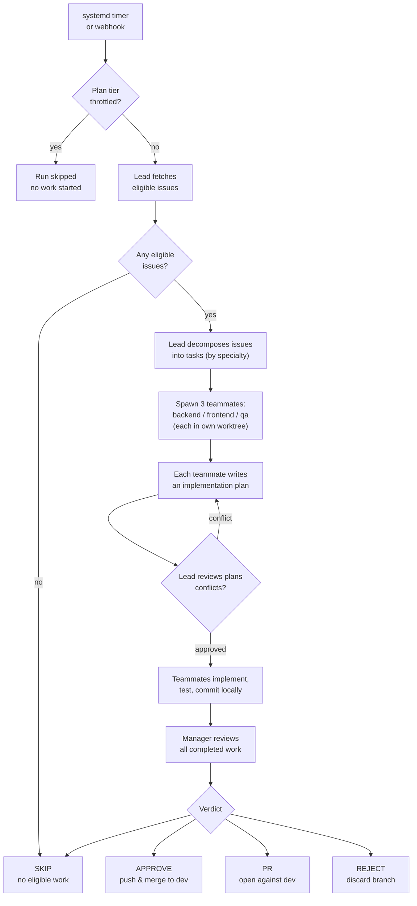

> **TL;DR** — A run takes a GitHub issue from picked-up to merged or PR'd in seven phases.

A "run" is one full execution of the agent: triggered by a timer or a webhook, ending with a verdict that decides what happens to the work. Click any node in the diagram below to jump into the relevant section.

### The seven phases

1. **Trigger.** A systemd timer fires, or a GitHub webhook arrives. The run-manager script starts.
2. **Throttle gate.** If weekly Claude usage has exceeded the configured threshold, the run is skipped before any work starts.
3. **Issue selection.** The lead agent fetches open issues from enabled repos and filters out anything labelled `backlog`, `wontfix`, `NO AI`, or already in progress.
4. **Decomposition & spawn.** The lead breaks eligible issues into tasks and spawns three teammates — `backend`, `frontend`, `qa` — each in its own git worktree so they cannot collide.
5. **Plan review.** Every teammate writes an implementation plan first. The lead reviews the plans together and rejects any that conflict; teammates revise and resubmit.
6. **Implement.** Approved teammates write code, run tests, and commit locally.
7. **Manager review & verdict.** Once all teammates finish, a separate manager pass reviews the work and issues one of four verdicts: `APPROVE`, `PR`, `REJECT`, or `SKIP`. The verdict decides what happens to the branch.

<!-- under-the-hood -->

### Where the code lives

- **Trigger:** systemd timer (`agent/systemd/`), GitHub webhook intake at `dashboard/backend/app/routers/github_webhook.py`.
- **Throttle decision:** `agent/scripts/detect_plan_usage.py` and the `plan_usage_history` table.
- **Orchestrator:** `agent/station_orchestrator.py` runs the lead + teammates in a single Claude Agent SDK Agent Teams session.
- **Manager review:** invoked by `agent/scripts/run-manager.sh` after teammates finish; uses the prompt at `agent/prompts/manager.md`.
- **Skip-label filter:** the `SKIP_LABELS` constant in `agent/station_orchestrator.py`.
- **Verdict enforcement:** `run-manager.sh` reads the manager's verdict and performs the corresponding git action (push, PR via `gh`, branch delete).
