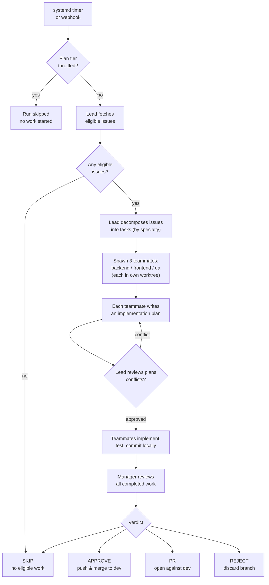

# Help Page Implementation Plan

> **For agentic workers:** REQUIRED SUB-SKILL: Use superpowers:subagent-driven-development (recommended) or superpowers:executing-plans to implement this plan task-by-task. Steps use checkbox (`- [ ]`) syntax for tracking.

**Goal:** Build an in-dashboard `/help` page with a contextual `?` drawer so the operator can understand the station from inside the dashboard, with a Mermaid flowchart of the run lifecycle.

**Architecture:** A single `/help` route renders 8 sections sourced from one markdown file each. A reusable `<HelpHint>` icon, placed next to conceptually-loaded UI elements, opens a side drawer that renders the same `<HelpSection>` component scoped to one section. The Mermaid flowchart's nodes are clickable and route into the drawer.

**Tech Stack:** Svelte 5, TypeScript, TailwindCSS, Vite, Vitest, `marked` + `dompurify` (already installed), `mermaid` (new).

**Spec:** `docs/superpowers/specs/2026-05-10-help-page-design.md`

---

## File Structure

**New files (frontend):**

- `dashboard/frontend/src/lib/help-drawer.svelte.ts` — drawer state store
- `dashboard/frontend/src/lib/help-content.ts` — markdown loader + section splitter (pure logic, fully unit-testable)
- `dashboard/frontend/src/lib/help-content.test.ts` — unit tests for the splitter
- `dashboard/frontend/src/components/help/MermaidDiagram.svelte` — lazy-loaded Mermaid wrapper
- `dashboard/frontend/src/components/help/HelpSection.svelte` — renders one section: TL;DR + how-it-works + collapsible under-the-hood
- `dashboard/frontend/src/components/help/HelpHint.svelte` — the `?` icon
- `dashboard/frontend/src/components/help/HelpDrawer.svelte` — wraps `SlidePanel` and renders one `<HelpSection>`
- `dashboard/frontend/src/pages/HelpPage.svelte` — `/help` route, sticky sidebar + 8 sections
- `dashboard/frontend/src/content/help/run-lifecycle.md`
- `dashboard/frontend/src/content/help/roles.md`
- `dashboard/frontend/src/content/help/verdicts.md`
- `dashboard/frontend/src/content/help/eligibility.md`
- `dashboard/frontend/src/content/help/throttling.md`
- `dashboard/frontend/src/content/help/plans-worktrees.md`
- `dashboard/frontend/src/content/help/pages-tour.md`
- `dashboard/frontend/src/content/help/troubleshooting.md`

**Modified files:**

- `dashboard/frontend/package.json` — add `mermaid`
- `dashboard/frontend/src/lib/router.svelte.ts` — add `'help'` to `Page`, route `/help`
- `dashboard/frontend/src/App.svelte` — register `HelpPage`, mount `<HelpDrawer>` once
- `dashboard/frontend/src/components/layout/TopNav.svelte` — append `Help` to `navItems`
- `dashboard/frontend/src/pages/RunDetail.svelte` — add `<HelpHint>` next to verdict pills and plan-review controls
- `dashboard/frontend/src/pages/AgentTeamsCanvas.svelte` — add `<HelpHint>` next to Team Lead label and the three teammate role labels
- `dashboard/frontend/src/pages/CommandCenter.svelte` — add `<HelpHint>` next to throttled / skipped indicators (locations discovered in Task 16)

**Reused (no changes):**

- `dashboard/frontend/src/components/overlays/SlidePanel.svelte` — already provides backdrop, Esc handling, slide-in
- `dashboard/frontend/src/components/data-display/MarkdownRenderer.svelte` — already wraps marked + DOMPurify

---

## Conventions

- Svelte 5 runes (`$state`, `$derived`, `$props`, `$effect`).
- TypeScript on every component (`<script lang="ts">`).
- TailwindCSS utilities; CSS variables (`var(--color-text)` etc.) for theming where they already exist.
- Tests use Vitest (`.test.ts`).
- Each task ends with a single commit.
- Branch: a single feature branch `feature/help-page` for the whole plan; PR opened in Task 17 against `dev` (project rule: PRs target `dev`, never `main`).

---

## Task 1: Create the feature branch

**Files:** none

- [ ] **Step 1: Branch off `dev`**

```bash
git checkout dev
git pull --ff-only
git checkout -b feature/help-page
```

- [ ] **Step 2: Verify branch**

```bash
git status
git branch --show-current
```

Expected: clean working tree, branch is `feature/help-page`.

---

## Task 2: Drawer state store

**Files:**
- Create: `dashboard/frontend/src/lib/help-drawer.svelte.ts`
- Test: deferred to Task 3 (paired with content splitter)

- [ ] **Step 1: Create the store**

```ts
// dashboard/frontend/src/lib/help-drawer.svelte.ts
// ============================================
// Help Drawer — global state for the contextual ? drawer
// ============================================

export const helpDrawer = $state<{ openSection: string | null }>({ openSection: null });

export function openHelpDrawer(section: string): void {
  helpDrawer.openSection = section;
}

export function closeHelpDrawer(): void {
  helpDrawer.openSection = null;
}
```

- [ ] **Step 2: Verify it compiles**

```bash
cd dashboard/frontend && npx tsc --noEmit
```

Expected: no new errors from this file.

- [ ] **Step 3: Commit**

```bash
git add dashboard/frontend/src/lib/help-drawer.svelte.ts
git commit -m "feat(help): drawer state store"
```

---

## Task 3: Markdown content splitter (TDD)

The splitter takes a markdown string and produces three parts: TL;DR (the leading blockquote), how-it-works (body before `<!-- under-the-hood -->`), and under-the-hood (body after the marker, optional).

**Files:**
- Create: `dashboard/frontend/src/lib/help-content.ts`
- Test: `dashboard/frontend/src/lib/help-content.test.ts`

- [ ] **Step 1: Write the failing tests**

```ts
// dashboard/frontend/src/lib/help-content.test.ts
import { describe, it, expect } from 'vitest';
import { splitHelpSection } from './help-content';

describe('splitHelpSection', () => {
  it('extracts TL;DR from a leading blockquote', () => {
    const md = '> **TL;DR** — A run takes an issue from picked-up to merged.\n\nBody text here.';
    const result = splitHelpSection(md);
    expect(result.tldr).toBe('A run takes an issue from picked-up to merged.');
    expect(result.howItWorks.trim()).toBe('Body text here.');
    expect(result.underTheHood).toBeNull();
  });

  it('splits how-it-works and under-the-hood on the marker', () => {
    const md = [
      '> **TL;DR** — Lead, teammates, manager.',
      '',
      'How it works body.',
      '',
      '<!-- under-the-hood -->',
      '',
      'Deep technical bits.',
    ].join('\n');
    const result = splitHelpSection(md);
    expect(result.tldr).toBe('Lead, teammates, manager.');
    expect(result.howItWorks.trim()).toBe('How it works body.');
    expect(result.underTheHood?.trim()).toBe('Deep technical bits.');
  });

  it('treats missing TL;DR as null', () => {
    const md = 'Just plain prose, no blockquote.';
    const result = splitHelpSection(md);
    expect(result.tldr).toBeNull();
    expect(result.howItWorks.trim()).toBe('Just plain prose, no blockquote.');
    expect(result.underTheHood).toBeNull();
  });

  it('strips a "TL;DR —" prefix variant', () => {
    const md = '> TL;DR — short summary.\n\nBody.';
    const result = splitHelpSection(md);
    expect(result.tldr).toBe('short summary.');
  });

  it('keeps fenced mermaid blocks intact in the body', () => {
    const md = [
      '> **TL;DR** — flow.',
      '',
      'Intro.',
      '',
      '```mermaid',
      'flowchart TD',
      '  A --> B',
      '```',
      '',
      'Outro.',
    ].join('\n');
    const result = splitHelpSection(md);
    expect(result.howItWorks).toContain('```mermaid');
    expect(result.howItWorks).toContain('flowchart TD');
  });
});
```

- [ ] **Step 2: Run tests to confirm they fail**

```bash
cd dashboard/frontend && npx vitest run src/lib/help-content.test.ts
```

Expected: FAIL — module `./help-content` not found.

- [ ] **Step 3: Implement the splitter**

```ts
// dashboard/frontend/src/lib/help-content.ts
// ============================================
// Help Content — parse a section markdown file into TL;DR, how-it-works,
// and under-the-hood parts. Pure functions, fully unit-tested.
// ============================================

export interface HelpSectionParts {
  tldr: string | null;
  howItWorks: string;
  underTheHood: string | null;
}

const UNDER_THE_HOOD_MARKER = '<!-- under-the-hood -->';

// Matches a leading blockquote line that opens with `**TL;DR**` or `TL;DR`.
// Captures the prose after the em-dash separator.
const TLDR_RE = /^>\s*(?:\*\*TL;DR\*\*|TL;DR)\s*[—-]\s*(.+?)\s*$/m;

export function splitHelpSection(source: string): HelpSectionParts {
  const markerIdx = source.indexOf(UNDER_THE_HOOD_MARKER);
  let body: string;
  let underTheHood: string | null;

  if (markerIdx === -1) {
    body = source;
    underTheHood = null;
  } else {
    body = source.slice(0, markerIdx);
    underTheHood = source.slice(markerIdx + UNDER_THE_HOOD_MARKER.length);
  }

  const tldrMatch = body.match(TLDR_RE);
  const tldr = tldrMatch ? tldrMatch[1].trim() : null;

  // Strip the matched TL;DR line from the body so it isn't duplicated.
  const howItWorks = tldrMatch
    ? body.replace(tldrMatch[0], '').replace(/^\s*\n+/, '')
    : body;

  return { tldr, howItWorks, underTheHood };
}
```

- [ ] **Step 4: Run tests to confirm they pass**

```bash
cd dashboard/frontend && npx vitest run src/lib/help-content.test.ts
```

Expected: PASS — 5 tests passing.

- [ ] **Step 5: Commit**

```bash
git add dashboard/frontend/src/lib/help-content.ts dashboard/frontend/src/lib/help-content.test.ts
git commit -m "feat(help): markdown section splitter with tests"
```

---

## Task 4: Install Mermaid

**Files:**
- Modify: `dashboard/frontend/package.json`

- [ ] **Step 1: Install Mermaid**

```bash
cd dashboard/frontend && npm install mermaid
```

Expected: `mermaid` added to `dependencies`. `package-lock.json` updated.

- [ ] **Step 2: Verify install**

```bash
cd dashboard/frontend && node -e "console.log(require('mermaid/package.json').version)"
```

Expected: a version string (≥10.x).

- [ ] **Step 3: Commit**

```bash
git add dashboard/frontend/package.json dashboard/frontend/package-lock.json
git commit -m "chore(deps): add mermaid for help-page flowchart"
```

---

## Task 5: MermaidDiagram component

A Svelte component that lazy-imports `mermaid`, renders a passed source string to SVG on mount, and exposes a callback registry for `click` directives in the Mermaid source.

**Files:**
- Create: `dashboard/frontend/src/components/help/MermaidDiagram.svelte`

- [ ] **Step 1: Create the component directory and file**

```bash
mkdir -p dashboard/frontend/src/components/help
```

```svelte
<!-- dashboard/frontend/src/components/help/MermaidDiagram.svelte -->
<script lang="ts">
  import { onMount } from 'svelte';
  import { openHelpDrawer } from '../../lib/help-drawer.svelte';

  let { source }: { source: string } = $props();

  let host: HTMLDivElement;
  let error = $state<string | null>(null);

  // Mermaid `click <node> call openHelpDrawer("section")` directives need a
  // global function reference. Expose it on `window` once.
  if (typeof window !== 'undefined') {
    (window as unknown as { openHelpDrawer?: (s: string) => void }).openHelpDrawer = openHelpDrawer;
  }

  onMount(async () => {
    try {
      const mermaid = (await import('mermaid')).default;
      mermaid.initialize({
        startOnLoad: false,
        theme: 'base',
        securityLevel: 'loose', // required for `click ... call ...` directives
        themeVariables: {
          primaryColor: 'var(--color-surface-1, #1f2937)',
          primaryTextColor: 'var(--color-text, #e5e7eb)',
          primaryBorderColor: 'var(--color-border, #374151)',
          lineColor: 'var(--color-border, #6b7280)',
          fontFamily: 'inherit',
        },
      });
      const id = `mermaid-${Math.random().toString(36).slice(2)}`;
      const { svg, bindFunctions } = await mermaid.render(id, source);
      host.innerHTML = svg;
      bindFunctions?.(host);
    } catch (e) {
      error = e instanceof Error ? e.message : String(e);
    }
  });
</script>

<div class="mermaid-host" bind:this={host}>
  {#if error}
    <pre class="mermaid-fallback">{source}</pre>
    <p class="mermaid-error" role="alert">Diagram failed to render: {error}</p>
  {/if}
</div>

<style>
  .mermaid-host { display: flex; justify-content: center; margin: 1rem 0; }
  .mermaid-host :global(svg) { max-width: 100%; height: auto; cursor: default; }
  .mermaid-fallback {
    background: var(--color-pre-bg);
    border: 1px solid var(--color-pre-border);
    border-radius: 0.5em;
    padding: 0.75em 1em;
    overflow-x: auto;
    font-size: 0.85em;
  }
  .mermaid-error { color: var(--abort, #dc2626); font-size: 0.85em; margin-top: 0.5em; }
</style>
```

- [ ] **Step 2: Type-check**

```bash
cd dashboard/frontend && npx tsc --noEmit
```

Expected: no new errors.

- [ ] **Step 3: Commit**

```bash
git add dashboard/frontend/src/components/help/MermaidDiagram.svelte
git commit -m "feat(help): MermaidDiagram component with click-callback support"
```

---

## Task 6: HelpSection component

Renders a parsed help section: TL;DR callout, how-it-works (markdown, with Mermaid blocks substituted), and under-the-hood (collapsible).

**Files:**
- Create: `dashboard/frontend/src/components/help/HelpSection.svelte`

- [ ] **Step 1: Add a content registry for the 8 markdown files**

This goes inside `HelpSection.svelte`. We use Vite's `import.meta.glob` with `?raw` to bundle all markdown files at build time and look them up by id.

- [ ] **Step 2: Create the component**

```svelte
<!-- dashboard/frontend/src/components/help/HelpSection.svelte -->
<script lang="ts">
  import { splitHelpSection } from '../../lib/help-content';
  import MarkdownRenderer from '../data-display/MarkdownRenderer.svelte';
  import MermaidDiagram from './MermaidDiagram.svelte';

  let { id }: { id: string } = $props();

  // Eagerly-imported raw markdown for all help sections.
  const sources = import.meta.glob('../../content/help/*.md', {
    query: '?raw',
    import: 'default',
    eager: true,
  }) as Record<string, string>;

  function lookup(sectionId: string): string | null {
    const key = Object.keys(sources).find((p) => p.endsWith(`/${sectionId}.md`));
    return key ? sources[key] : null;
  }

  const raw = $derived(lookup(id));
  const parts = $derived(raw ? splitHelpSection(raw) : null);

  // Split the how-it-works body around fenced ```mermaid blocks so we can
  // render each block with <MermaidDiagram> and the surrounding prose with
  // <MarkdownRenderer>.
  type Chunk = { kind: 'md' | 'mermaid'; content: string };

  function chunkBody(body: string): Chunk[] {
    const re = /```mermaid\n([\s\S]*?)```/g;
    const out: Chunk[] = [];
    let lastIdx = 0;
    let m: RegExpExecArray | null;
    while ((m = re.exec(body)) !== null) {
      if (m.index > lastIdx) out.push({ kind: 'md', content: body.slice(lastIdx, m.index) });
      out.push({ kind: 'mermaid', content: m[1] });
      lastIdx = re.lastIndex;
    }
    if (lastIdx < body.length) out.push({ kind: 'md', content: body.slice(lastIdx) });
    return out;
  }

  const howItWorksChunks = $derived(parts ? chunkBody(parts.howItWorks) : []);
</script>

{#if parts}
  {#if parts.tldr}
    <div class="tldr">
      <span class="tldr-label">TL;DR</span>
      <span class="tldr-text">{parts.tldr}</span>
    </div>
  {/if}

  {#each howItWorksChunks as chunk}
    {#if chunk.kind === 'md'}
      <MarkdownRenderer content={chunk.content} />
    {:else}
      <MermaidDiagram source={chunk.content} />
    {/if}
  {/each}

  {#if parts.underTheHood}
    <details class="uth">
      <summary>Under the hood</summary>
      <MarkdownRenderer content={parts.underTheHood} />
    </details>
  {/if}
{:else}
  <p class="missing">Help section <code>{id}</code> not found.</p>
{/if}

<style>
  .tldr {
    display: flex;
    gap: 0.5rem;
    align-items: baseline;
    padding: 0.6rem 0.85rem;
    margin: 0 0 0.75rem 0;
    border-left: 3px solid var(--color-link, #06b6d4);
    background: var(--color-surface-1, rgba(6, 182, 212, 0.06));
    border-radius: 0 0.375rem 0.375rem 0;
    font-size: 0.9rem;
  }
  .tldr-label {
    font-size: 0.7rem;
    font-weight: 700;
    letter-spacing: 0.05em;
    color: var(--color-link, #06b6d4);
    text-transform: uppercase;
  }
  .tldr-text { color: var(--color-text); }

  .uth {
    margin-top: 1rem;
    border: 1px solid var(--color-border);
    border-radius: 0.5rem;
    padding: 0.5rem 0.85rem;
  }
  .uth > summary {
    cursor: pointer;
    font-weight: 600;
    color: var(--color-text-dim);
    font-size: 0.85rem;
    user-select: none;
  }
  .uth[open] > summary { margin-bottom: 0.5rem; }

  .missing { color: var(--color-text-dim); font-style: italic; }
</style>
```

- [ ] **Step 3: Type-check**

```bash
cd dashboard/frontend && npx tsc --noEmit
```

Expected: no new errors.

- [ ] **Step 4: Commit**

```bash
git add dashboard/frontend/src/components/help/HelpSection.svelte
git commit -m "feat(help): HelpSection renders TL;DR + how-it-works + under-the-hood"
```

---

## Task 7: HelpHint component

The `?` icon. Sits next to a labelled element; clicking opens the drawer for the given section.

**Files:**
- Create: `dashboard/frontend/src/components/help/HelpHint.svelte`

- [ ] **Step 1: Create the component**

```svelte
<!-- dashboard/frontend/src/components/help/HelpHint.svelte -->
<script lang="ts">
  import { openHelpDrawer } from '../../lib/help-drawer.svelte';

  let {
    section,
    label = 'Help',
  }: {
    section: string;
    label?: string;
  } = $props();
</script>

<button
  type="button"
  class="help-hint"
  aria-label="Help: {label}"
  onclick={(e) => { e.stopPropagation(); openHelpDrawer(section); }}
>?</button>

<style>
  .help-hint {
    display: inline-flex;
    align-items: center;
    justify-content: center;
    width: 14px;
    height: 14px;
    margin-left: 0.35rem;
    padding: 0;
    border: 1px solid var(--color-border);
    border-radius: 999px;
    background: transparent;
    color: var(--color-text-dim);
    font-size: 9px;
    line-height: 1;
    font-weight: 700;
    cursor: pointer;
    vertical-align: middle;
    transition: color 120ms, border-color 120ms;
  }
  .help-hint:hover,
  .help-hint:focus-visible {
    color: var(--color-text);
    border-color: var(--color-link, currentColor);
    outline: none;
  }
</style>
```

- [ ] **Step 2: Type-check**

```bash
cd dashboard/frontend && npx tsc --noEmit
```

Expected: no new errors.

- [ ] **Step 3: Commit**

```bash
git add dashboard/frontend/src/components/help/HelpHint.svelte
git commit -m "feat(help): HelpHint icon component"
```

---

## Task 8: HelpDrawer component

Wraps `SlidePanel` and renders a single `<HelpSection>`. Reads `helpDrawer.openSection` to decide what (if anything) to show.

**Files:**
- Create: `dashboard/frontend/src/components/help/HelpDrawer.svelte`

- [ ] **Step 1: Build a section-id → title map**

Inside the component, hard-code the 8 section titles so the drawer header reads "Verdicts" rather than `verdicts`.

- [ ] **Step 2: Create the component**

```svelte
<!-- dashboard/frontend/src/components/help/HelpDrawer.svelte -->
<script lang="ts">
  import SlidePanel from '../overlays/SlidePanel.svelte';
  import HelpSection from './HelpSection.svelte';
  import { helpDrawer, closeHelpDrawer } from '../../lib/help-drawer.svelte';
  import { navigate } from '../../lib/router.svelte';

  const TITLES: Record<string, string> = {
    'run-lifecycle': 'Run lifecycle',
    'roles': 'The three roles',
    'verdicts': 'Verdicts',
    'eligibility': 'Issue eligibility',
    'throttling': 'Plan-tier throttling',
    'plans-worktrees': 'Plans & worktrees',
    'pages-tour': 'Page-by-page tour',
    'troubleshooting': 'Troubleshooting',
  };

  const open = $derived(helpDrawer.openSection !== null);
  const sectionId = $derived(helpDrawer.openSection ?? '');
  const title = $derived(TITLES[sectionId] ?? 'Help');

  function viewFullPage() {
    const target = sectionId;
    closeHelpDrawer();
    navigate(`/help#${target}`);
  }
</script>

<SlidePanel {open} onClose={closeHelpDrawer} {title} width="w-[480px]">
  {#if sectionId}
    <HelpSection id={sectionId} />
    <div class="full-link">
      <button type="button" onclick={viewFullPage}>View full Help page →</button>
    </div>
  {/if}
</SlidePanel>

<style>
  .full-link {
    margin-top: 1.25rem;
    padding-top: 1rem;
    border-top: 1px solid var(--color-border);
  }
  .full-link button {
    background: none;
    border: none;
    padding: 0;
    color: var(--color-link, #06b6d4);
    font-size: 0.9rem;
    cursor: pointer;
    text-decoration: underline;
    text-underline-offset: 2px;
  }
</style>
```

- [ ] **Step 3: Verify SlidePanel accepts the `width="w-[480px]"` prop**

Skim `dashboard/frontend/src/components/overlays/SlidePanel.svelte` lines 1–17 to confirm `width` is a string passed to a class. If Tailwind 4 strips arbitrary values from runtime classes, change `w-[480px]` to a built-in like `w-[28rem]` is also dynamic — fall back to `w-96` (24rem) and accept the slightly narrower drawer.

- [ ] **Step 4: Type-check**

```bash
cd dashboard/frontend && npx tsc --noEmit
```

Expected: no new errors.

- [ ] **Step 5: Commit**

```bash
git add dashboard/frontend/src/components/help/HelpDrawer.svelte
git commit -m "feat(help): HelpDrawer wraps SlidePanel and renders one section"
```

---

## Task 9: Add `'help'` to the router

**Files:**
- Modify: `dashboard/frontend/src/lib/router.svelte.ts`

- [ ] **Step 1: Add `'help'` to the `Page` union**

Find the `export type Page` declaration (top of the file). Append `| 'help'` to the union.

- [ ] **Step 2: Add `/help` to the `routeMap`**

Locate the `routeMap` const (around line 55). Add the entry:

```ts
const routeMap: Record<string, Page> = {
  'mission-control': 'mission-control',
  'agent-teams': 'agent-teams',
  queue: 'queue',
  projects: 'projects',
  settings: 'settings',
  help: 'help',
};
```

- [ ] **Step 3: Type-check**

```bash
cd dashboard/frontend && npx tsc --noEmit
```

Expected: no new errors. (Other code that exhausts `Page` may now flag the missing case — fix in Task 11 when registering the page.)

- [ ] **Step 4: Commit**

```bash
git add dashboard/frontend/src/lib/router.svelte.ts
git commit -m "feat(help): /help route in router"
```

---

## Task 10: Add Help to TopNav

**Files:**
- Modify: `dashboard/frontend/src/components/layout/TopNav.svelte`

- [ ] **Step 1: Append the Help nav item**

In `TopNav.svelte` around line 33, the `navItems` array is:

```ts
const navItems = [
  { label: 'Dispatch', page: 'command-center', path: '/' },
  { label: 'Mission', page: 'mission-control', path: '/mission-control' },
  { label: 'Fleet', page: 'agent-teams', path: '/agent-teams' },
  { label: 'Queue', page: 'queue', path: '/queue' },
  { label: 'Projects', page: 'projects', path: '/projects' },
  { label: 'Settings', page: 'settings', path: '/settings' },
] as const;
```

Append:

```ts
  { label: 'Help', page: 'help', path: '/help' },
```

before the closing `]`. Do **not** alter the existing entries — number-key shortcuts stay 1–6.

- [ ] **Step 2: Type-check**

```bash
cd dashboard/frontend && npx tsc --noEmit
```

Expected: no new errors.

- [ ] **Step 3: Commit**

```bash
git add dashboard/frontend/src/components/layout/TopNav.svelte
git commit -m "feat(help): TopNav Help item"
```

---

## Task 11: HelpPage with sticky sidebar, register route, mount drawer

**Files:**
- Create: `dashboard/frontend/src/pages/HelpPage.svelte`
- Modify: `dashboard/frontend/src/App.svelte`

- [ ] **Step 1: Create HelpPage**

```svelte
<!-- dashboard/frontend/src/pages/HelpPage.svelte -->
<script lang="ts">
  import HelpSection from '../components/help/HelpSection.svelte';
  import { onMount } from 'svelte';

  const SECTIONS: Array<{ id: string; title: string }> = [
    { id: 'run-lifecycle', title: 'Run lifecycle' },
    { id: 'roles', title: 'The three roles' },
    { id: 'verdicts', title: 'Verdicts' },
    { id: 'eligibility', title: 'Issue eligibility' },
    { id: 'throttling', title: 'Plan-tier throttling' },
    { id: 'plans-worktrees', title: 'Plans & worktrees' },
    { id: 'pages-tour', title: 'Page-by-page tour' },
    { id: 'troubleshooting', title: 'Troubleshooting' },
  ];

  // After mount, scroll to the location.hash anchor if present.
  onMount(() => {
    if (window.location.hash) {
      const id = window.location.hash.slice(1);
      // Defer one frame so the section elements are in the DOM.
      requestAnimationFrame(() => {
        document.getElementById(id)?.scrollIntoView({ behavior: 'smooth', block: 'start' });
      });
    }
  });
</script>

<div class="help-layout">
  <aside class="help-sidebar">
    <h2>Help</h2>
    <ul>
      {#each SECTIONS as s}
        <li><a href="#{s.id}">{s.title}</a></li>
      {/each}
    </ul>
  </aside>

  <main class="help-main">
    <h1>Claude Agent Station — Help</h1>
    <p class="lede">How the station works, layered for end users, operators, and contributors.</p>

    {#each SECTIONS as s}
      <section id={s.id} class="help-section-block">
        <h2>{s.title}</h2>
        <HelpSection id={s.id} />
      </section>
    {/each}
  </main>
</div>

<style>
  .help-layout {
    display: grid;
    grid-template-columns: 220px 1fr;
    gap: 2rem;
    padding: 1.5rem;
    max-width: 1100px;
    margin: 0 auto;
  }
  .help-sidebar {
    position: sticky;
    top: 1rem;
    align-self: start;
    border-right: 1px solid var(--color-border);
    padding-right: 1rem;
  }
  .help-sidebar h2 {
    font-size: 0.7rem;
    letter-spacing: 0.1em;
    text-transform: uppercase;
    color: var(--color-text-dim);
    margin-bottom: 0.75rem;
  }
  .help-sidebar ul { list-style: none; padding: 0; margin: 0; display: flex; flex-direction: column; gap: 0.25rem; }
  .help-sidebar a {
    color: var(--color-text-dim);
    text-decoration: none;
    font-size: 0.9rem;
    padding: 0.25rem 0;
    display: block;
  }
  .help-sidebar a:hover { color: var(--color-text); }

  .help-main h1 { font-size: 1.5rem; margin: 0 0 0.25rem 0; }
  .lede { color: var(--color-text-dim); margin-bottom: 1.5rem; }
  .help-section-block { margin-top: 2.5rem; scroll-margin-top: 1rem; }
  .help-section-block > h2 {
    font-size: 1.2rem;
    margin: 0 0 0.75rem 0;
    padding-bottom: 0.4rem;
    border-bottom: 1px solid var(--color-border);
  }

  @media (max-width: 720px) {
    .help-layout { grid-template-columns: 1fr; }
    .help-sidebar { position: static; border-right: none; border-bottom: 1px solid var(--color-border); padding-right: 0; padding-bottom: 0.75rem; }
    .help-sidebar ul { flex-direction: row; flex-wrap: wrap; gap: 0.5rem 1rem; }
  }
</style>
```

- [ ] **Step 2: Register HelpPage and mount HelpDrawer in App.svelte**

In `App.svelte`, find the page imports block (currently imports `CommandCenter`, `MissionControl`, etc., near the top of `<script>`). Add:

```ts
import HelpPage from './pages/HelpPage.svelte';
import HelpDrawer from './components/help/HelpDrawer.svelte';
```

Find the page-routing template (where `route.page === 'command-center'` etc. is matched). Add the help branch in the same style — insert next to the other page branches:

```svelte
{:else if route.page === 'help'}
  <HelpPage />
```

Find the bottom of the App template, near where `<Toast>`, `<ShortcutsOverlay>`, and `<AuthPrompt>` are mounted. Add `<HelpDrawer />` alongside them so it's globally available.

- [ ] **Step 3: Type-check**

```bash
cd dashboard/frontend && npx tsc --noEmit
```

Expected: no new errors.

- [ ] **Step 4: Smoke test in dev**

```bash
cd dashboard/frontend && npm run dev
```

Open `http://localhost:<port>/help` in a browser. Expected: page renders with sidebar (8 stub entries) and "Section not found" placeholders for each section (because no markdown files exist yet — this is fine, fixed in the next task).

- [ ] **Step 5: Commit**

```bash
git add dashboard/frontend/src/pages/HelpPage.svelte dashboard/frontend/src/App.svelte
git commit -m "feat(help): /help page with sticky sidebar, drawer mounted globally"
```

---

## Task 12: Author the run-lifecycle markdown (with flowchart)

**Files:**
- Create: `dashboard/frontend/src/content/help/run-lifecycle.md`

- [ ] **Step 1: Create the file**

```bash
mkdir -p dashboard/frontend/src/content/help
```

```markdown
<!-- dashboard/frontend/src/content/help/run-lifecycle.md -->
> **TL;DR** — A run takes a GitHub issue from picked-up to merged or PR'd in seven phases.

A "run" is one full execution of the agent: triggered by a timer or a webhook, ending with a verdict that decides what happens to the work. Click any node in the diagram below to jump into the relevant section.



### The seven phases

1. **Trigger.** A systemd timer fires, or a GitHub webhook arrives. The run-manager script starts.
2. **Throttle gate.** If weekly Claude usage has exceeded the configured threshold, the run is skipped before any work starts.
3. **Issue selection.** The lead agent fetches open issues from enabled repos and filters out anything labelled `backlog`, `wontfix`, `NO AI`, or already in progress.
4. **Decomposition & spawn.** The lead breaks eligible issues into tasks and spawns three teammates — `backend`, `frontend`, `qa` — each in its own git worktree so they cannot collide.
5. **Plan review.** Every teammate writes an implementation plan first. The lead reviews the plans together and rejects any that conflict; teammates revise and resubmit.
6. **Implement.** Approved teammates write code, run tests, and commit locally.
7. **Manager review & verdict.** Once all teammates finish, a separate manager pass reviews the work and issues one of four verdicts: `APPROVE`, `PR`, `REJECT`, or `SKIP`. The verdict decides what happens to the branch.

<!-- under-the-hood -->

### Where the code lives

- **Trigger:** systemd timer (`agent/systemd/`), GitHub webhook intake at `dashboard/backend/app/routers/github_webhook.py`.
- **Throttle decision:** `agent/scripts/detect_plan_usage.py` and the `plan_usage_history` table.
- **Orchestrator:** `agent/station_orchestrator.py` runs the lead + teammates in a single Claude Agent SDK Agent Teams session.
- **Manager review:** invoked by `agent/scripts/run-manager.sh` after teammates finish; uses the prompt at `agent/prompts/manager.md`.
- **Skip-label filter:** the `SKIP_LABELS` constant in `agent/station_orchestrator.py`.
- **Verdict enforcement:** `run-manager.sh` reads the manager's verdict and performs the corresponding git action (push, PR via `gh`, branch delete).
```

- [ ] **Step 2: Reload `/help` in the browser**

Expected: the Run lifecycle section now renders prose, the flowchart appears, and clicking a node opens the drawer.

- [ ] **Step 3: Commit**

```bash
git add dashboard/frontend/src/content/help/run-lifecycle.md
git commit -m "docs(help): run lifecycle section with flowchart"
```

---

## Task 13: Author the remaining seven markdown files

For each section: create the file with TL;DR, how-it-works prose, and a `<!-- under-the-hood -->` deep-dive. Source from `docs/concepts.md`, `docs/architecture.md`, and the code paths cited in the spec's per-section briefs table.

**Files:**
- Create: `dashboard/frontend/src/content/help/roles.md`
- Create: `dashboard/frontend/src/content/help/verdicts.md`
- Create: `dashboard/frontend/src/content/help/eligibility.md`
- Create: `dashboard/frontend/src/content/help/throttling.md`
- Create: `dashboard/frontend/src/content/help/plans-worktrees.md`
- Create: `dashboard/frontend/src/content/help/pages-tour.md`
- Create: `dashboard/frontend/src/content/help/troubleshooting.md`

- [ ] **Step 1: roles.md**

```markdown
> **TL;DR** — Lead coordinates, three teammates implement, manager reviews. Each runs a different Claude model.

The station's work is split across three roles. Each role has a different responsibility, prompt, and model:

| Role | Model | Responsibility |
|---|---|---|
| **Lead** | Sonnet 4.6 | Picks eligible issues, decomposes them into tasks, spawns the three teammates, reviews their plans, and watches the run until done. |
| **Teammates** (×3) | Opus 4.7 | Three role-specialists per run — `backend`, `frontend`, `qa`. Each works in its own git worktree on the tasks routed to its specialty. |
| **Manager** | Sonnet 4.6 | A separate review pass after teammates finish. Reads the work and issues a verdict (APPROVE / PR / REJECT / SKIP). |

The lead and teammates run inside a single Claude Agent SDK Agent Teams session. The manager runs as a follow-up phase.

<!-- under-the-hood -->

- Agent definitions: `agent/agents/issue-worker.md` (teammate worker definition).
- Prompts: `agent/prompts/manager.md`, role overlays in `agent/prompts/roles/`.
- Orchestrator that spawns lead + teammates: `agent/station_orchestrator.py`.
- Manager invocation: `agent/scripts/run-manager.sh`.
- Per-role model overrides live in the agent config DB (`/var/lib/claude-agent-station/station.db`).
```

- [ ] **Step 2: verdicts.md**

```markdown
> **TL;DR** — Every run ends in one of four verdicts. The verdict decides what happens to the branch.

After the manager reviews the teammates' work, the run terminates with exactly one verdict:

| Verdict | What happens to the work |
|---|---|
| **APPROVE** | Branch is pushed and merged into `dev`. |
| **PR** | A pull request is opened against `dev` for human review. |
| **REJECT** | Branch is discarded. The run is marked failed. |
| **SKIP** | Nothing to merge — usually because there was no eligible work for this project. The queue item is marked completed (not failed). |

You'll see verdicts on the Mission Control feed, on Run Detail, and in the run lists across the dashboard.

<!-- under-the-hood -->

- Verdicts are written to the `verdict` column on the `runs` table by `run-manager.sh`.
- The audit log (`audit_log` table) records each tool call the manager makes during review.
- The reasoning behind a verdict is stored in `verdict_detail` and surfaced on Run Detail.
```

- [ ] **Step 3: eligibility.md**

```markdown
> **TL;DR** — Issues are skipped if the repo isn't enabled, the issue is closed, or it carries a skip label.

The lead picks GitHub issues that pass these filters:

- The repository is enabled in the dashboard.
- The issue is open.
- The issue is **not** labelled with any of the skip set:
  - `autonomous-agent/in-progress` — already being worked on.
  - `autonomous-agent/needs-help` — flagged for human follow-up.
  - `NO AI` — explicit human-only marker.
  - `backlog` — explicitly out of scope. **The agent will never pick up a backlog issue.**
  - `wontfix` — closed by intent, even if open.
  - `vision-suggested` — produced by the vision pipeline, not yet promoted.

Eligible issues are then decomposed into tasks and routed across the three teammates by specialty.

<!-- under-the-hood -->

- The skip set is the `SKIP_LABELS` constant in `agent/station_orchestrator.py`.
- The "enabled repo" flag is the `enabled` column on the `projects` table.
- A skipped issue is recorded in the run log with the reason it was skipped.
```

- [ ] **Step 4: throttling.md**

```markdown
> **TL;DR** — When weekly Claude usage gets too high, runs are paused before they start so the agent doesn't run out of budget mid-task.

Claude Agent Station is bounded by the Claude plan tier you've configured. The station tracks weekly token consumption and refuses to start a new run when usage crosses the threshold — better to pause cleanly than to fail mid-task with no budget to recover.

There are two protections:

1. **Plan-tier throttle.** Weekly usage (overall and per-model) is checked before each run. If the budget is too low, `run-manager.sh` short-circuits before launching any agent.
2. **Per-model fallback.** Every Claude invocation passes a `--fallback-model` to the SDK so primary-model errors don't kill the run. Opus 4.7 falls back to Sonnet 4.6, Sonnet 4.6 falls back to Haiku 4.5.

The Command Center surfaces current usage and the active throttle state.

<!-- under-the-hood -->

- Usage history: `plan_usage_history` table.
- Detection: `agent/scripts/detect_plan_usage.py`.
- Throttle decision API: served from the dashboard backend; consumed by Command Center.
- Throttling is independent of the fallback chain — both can be active.
```

- [ ] **Step 5: plans-worktrees.md**

```markdown
> **TL;DR** — Each teammate writes a plan first, gets it approved by the lead, then works in its own git worktree.

Two protections keep concurrent teammates from clobbering each other:

**Plans.** Every teammate's first deliverable is a short implementation plan. The lead reviews each plan before the teammate is allowed to start writing code. If two plans conflict — e.g. both teammates want to modify the same file — the lead asks the affected teammate to revise.

**Worktrees.** Each teammate runs in its own git worktree at `<workspaces_dir>/<repo>-<role>` (e.g. `/home/claude-agent/workspaces/my-repo-backend`). File edits from one teammate are invisible to the others until the changes are committed and merged. Worktrees are created per run and torn down when the run ends.

<!-- under-the-hood -->

- Workspaces directory is configurable; default `/home/claude-agent/workspaces/`.
- Worktree paths follow `<workspaces_dir>/<repo-name>-<role>`. Roles are `backend`, `frontend`, `qa`.
- The lead's plan-review behaviour is encoded in the orchestrator and the lead prompt.
- Plans are stored in the `plans` table and surfaced on Run Detail.
```

- [ ] **Step 6: pages-tour.md**

```markdown
> **TL;DR** — What each dashboard page is for, and when to open it.

- **Dispatch** (`/`) — the home page. Trigger a run, see live token burn, current throttle state.
- **Mission** (`/mission-control`) — live activity feed across all projects.
- **Fleet** (`/agent-teams`) — visual canvas of the lead and the three teammates for the current run.
- **Queue** (`/queue`) — the work queue: items waiting, in flight, completed.
- **Projects** (`/projects`) — list of repos. Click in to enable/disable, configure, see project-level history.
- **Project Detail** — drill-down for one project: vision, runs, settings.
- **Run Detail** — drill-down for one run: DAG, logs, plan, verdict, diff.
- **Settings** (`/settings`) — auth (OAuth, GitHub App), models, prompts, audit, appearance.
- **Help** (`/help`) — this page.

<!-- under-the-hood -->

- All pages are Svelte 5 components under `dashboard/frontend/src/pages/`.
- Cross-page navigation uses the History API via `lib/router.svelte.ts`. Number keys 1–6 map to the first six tabs.
```

- [ ] **Step 7: troubleshooting.md**

```markdown
> **TL;DR** — Common "why isn't it doing what I expected?" answers.

**No run started after the timer fired.**
Check the throttle state on Dispatch. If weekly usage is high, runs are deliberately paused. See Plan-tier throttling.

**My issue was skipped.**
Check the issue's labels. Anything in the skip set (`backlog`, `wontfix`, `NO AI`, …) blocks it. Also check the project is enabled. See Issue eligibility.

**The verdict was REJECT.**
The manager judged the work incomplete or wrong. Open Run Detail and read `verdict_detail` for the reasoning.

**The verdict was SKIP and nothing happened.**
Usually means there was no eligible work — common after the queue empties. Not a failure.

**A teammate looks stuck.**
Open Run Detail and check the audit log. Long-running tool calls (build, test) are normal; an unmoving log for many minutes likely means a hung subprocess.

**Where are the logs?**
Agent logs live at `/var/log/claude-agent/`. The dashboard surfaces them via WebSocket on Run Detail.

**How do I pause everything?**
The "Stop" button in the top nav engages a global pause when there are active runs.

<!-- under-the-hood -->

- Audit log: the `audit_log` table records every tool call. Retention defaults to 30 days.
- Run control: pause/resume/stop is implemented in `agent/run_control.py` and exposed via the dashboard API.
- Live logs: WebSocket served by `dashboard/backend/app/routers/logs.py`.
```

- [ ] **Step 8: Commit**

```bash
git add dashboard/frontend/src/content/help/
git commit -m "docs(help): author content for the seven non-flowchart sections"
```

---

## Task 14: Place HelpHint at verdict locations on Run Detail

**Files:**
- Modify: `dashboard/frontend/src/pages/RunDetail.svelte`

- [ ] **Step 1: Identify the three verdict-render sites**

From earlier reconnaissance:

- Lines 326–332 — `{:else if run.verdict === 'APPROVE'}` block (verdict pill in the page header).
- Line 460–461 — `<span class="v ...">{run.verdict}</span>` inline pill.
- Line 534 — `{:else if run.verdict}` followed by `Finished · Verdict {run.verdict}`.

(Line numbers may have drifted; locate by content if so.)

- [ ] **Step 2: Import HelpHint**

At the top of the `<script>` block in `RunDetail.svelte`, add:

```ts
import HelpHint from '../components/help/HelpHint.svelte';
```

- [ ] **Step 3: Add a single hint next to the most prominent verdict pill**

To avoid `?` icon noise, add a `HelpHint` only at the **page-header** verdict pill (the most-seen one — the lines 326–332 block). Wrap that block so the hint appears immediately after the verdict label:

```svelte
<span class="verdict-with-hint">
  <!-- existing verdict pill markup -->
  <HelpHint section="verdicts" label="Verdicts" />
</span>
```

Use a `display: inline-flex; align-items: center;` style on `.verdict-with-hint` if needed. Do **not** add hints to lines 460 and 534 — duplication on the same page is what the spec calls "noisy."

- [ ] **Step 4: Identify the plan-related UI**

Around line 268 the file mentions `'Reject this plan? The run will end with verdict=REJECT.'` — this is part of a plan-review block. Locate the visible "Plan" header or button group surrounding that confirm dialog. Add one hint:

```svelte
<HelpHint section="plans-worktrees" label="Plans & worktrees" />
```

immediately after the plan-section heading.

- [ ] **Step 5: Smoke test in dev**

Reload Run Detail in the browser. Click the `?` next to the verdict — drawer opens with "Verdicts." Click the `?` next to the plan section — drawer opens with "Plans & worktrees." Press Esc — drawer closes.

- [ ] **Step 6: Commit**

```bash
git add dashboard/frontend/src/pages/RunDetail.svelte
git commit -m "feat(help): contextual hints on Run Detail verdict and plan blocks"
```

---

## Task 15: Place HelpHint on Agent Teams Canvas

**Files:**
- Modify: `dashboard/frontend/src/pages/AgentTeamsCanvas.svelte`

- [ ] **Step 1: Import HelpHint**

```ts
import HelpHint from '../components/help/HelpHint.svelte';
```

- [ ] **Step 2: Add a hint next to the Team Lead label**

Around line 425, find:

```svelte
<span class="role"><span class="role-name">Team Lead</span> <span class="br">·</span> <span class="role-tag">Commander</span></span>
```

Append `<HelpHint section="roles" label="The three roles" />` inside the same `.role` span (so it stays inline with the label).

- [ ] **Step 3: Skip per-teammate hints**

The three teammate cells (lines ~466–474) all link to the same "roles" section. One hint on the Team Lead label is sufficient to cover the concept on this page.

- [ ] **Step 4: Smoke test**

Reload `/agent-teams` in the browser. Confirm the `?` appears next to "Team Lead", clicking opens the Roles drawer.

- [ ] **Step 5: Commit**

```bash
git add dashboard/frontend/src/pages/AgentTeamsCanvas.svelte
git commit -m "feat(help): contextual hint on Agent Teams Canvas Team Lead label"
```

---

## Task 16: Place HelpHint on Command Center

**Files:**
- Modify: `dashboard/frontend/src/pages/CommandCenter.svelte`

The throttling and skipped-state UI was not located by grep in the discovery phase. Locate it by reading the file and looking for: token-meter or plan-tier indicator, "skipped" status callouts, idle-state messages.

- [ ] **Step 1: Read CommandCenter and identify the throttle/skip UI**

```bash
grep -n -i "throttl\|plan\|tier\|skip\|usage\|burn" dashboard/frontend/src/pages/CommandCenter.svelte
```

Skim the file around the matches to find a *visible UI element* representing throttle state (a banner, a meter, a status pill). If no visible throttle UI exists, only place a hint on a skip-related element. If neither exists, this task contributes nothing — drop the hints from this file and rely on the flowchart click-through and the Help page itself.

- [ ] **Step 2: Import HelpHint**

```ts
import HelpHint from '../components/help/HelpHint.svelte';
```

- [ ] **Step 3: Place hints**

Add up to two hints, one per concept:

- Next to the throttle/usage indicator → `<HelpHint section="throttling" label="Plan-tier throttling" />`.
- Next to a skip-state callout → `<HelpHint section="eligibility" label="Issue eligibility" />`.

If only one element is present, only one hint is added. **Do not** add a hint where there is no labelled UI to attach it to.

- [ ] **Step 4: Smoke test**

Reload `/`. Confirm the hint(s) render and open the right drawer section.

- [ ] **Step 5: Commit**

```bash
git add dashboard/frontend/src/pages/CommandCenter.svelte
git commit -m "feat(help): contextual hints on Command Center throttle/skip UI"
```

---

## Task 17: Manual browser verification + open PR

UI features must be browser-tested before claiming complete. This is the verification gate.

**Files:** none for verification; PR opened at the end.

- [ ] **Step 1: Run the unit tests**

```bash
cd dashboard/frontend && npx vitest run
```

Expected: all tests pass, including the 5 new tests in `help-content.test.ts`.

- [ ] **Step 2: Type-check the whole frontend**

```bash
cd dashboard/frontend && npx tsc --noEmit
```

Expected: 0 errors.

- [ ] **Step 3: Build**

```bash
cd dashboard/frontend && npm run build
```

Expected: build succeeds.

- [ ] **Step 4: Run dev and manually verify (mandatory)**

```bash
cd dashboard/frontend && npm run dev
```

Walk through this checklist in a browser:

- [ ] `/help` loads. All 8 sections render with TL;DR + how-it-works visible. Sidebar shows 8 items.
- [ ] Each sidebar link scrolls to the matching section (URL updates with hash).
- [ ] The flowchart in "Run lifecycle" renders.
- [ ] Clicking each labelled flowchart node opens the drawer with the right section: throttle → throttling, eligibility nodes → eligibility, spawn/manager → roles, plans/review → plans-worktrees, verdict + outcomes → verdicts.
- [ ] The "Under the hood" accordion in each section opens and closes.
- [ ] Drawer behaviour: opens on `?` click, closes on Esc, closes on backdrop click, closes on close-button click. Only one drawer open at a time.
- [ ] "View full Help page →" link in the drawer footer closes the drawer and navigates to `/help#<section>` with the section in view.
- [ ] Run Detail: `?` next to the verdict pill opens Verdicts; `?` next to the plan block opens Plans & worktrees.
- [ ] Agent Teams Canvas: `?` next to "Team Lead" opens Roles.
- [ ] Command Center: hint(s) added in Task 16 open the expected drawer (or, if none was added because no UI existed, this check is N/A).
- [ ] Top nav: clicking "Help" navigates to `/help`. Number keys 1–6 still navigate to the original tabs (no regression).
- [ ] Theme toggle: switch between light and dark. Mermaid diagram still readable in both. Drawer chrome still readable in both.
- [ ] Narrow viewport (< 720 px width): sidebar collapses, drawer is full-width.
- [ ] Mermaid render failure path: temporarily corrupt the mermaid block in `run-lifecycle.md` (e.g. `flowchartTD`), reload, confirm the fallback `<pre>` and error message render. Revert the change before proceeding.

- [ ] **Step 5: Push and open PR**

```bash
git push -u origin feature/help-page
gh pr create --base dev --title "Help page with contextual ? drawer and run-lifecycle flowchart" --body "$(cat <<'EOF'
## Summary
- Adds a `/help` page with eight sections (run lifecycle, roles, verdicts, eligibility, throttling, plans & worktrees, page-by-page tour, troubleshooting), layered TL;DR / how-it-works / under-the-hood.
- Adds a contextual `?` icon (`HelpHint`) on conceptually loaded UI elements — verdict pill on Run Detail, Team Lead label on Agent Teams Canvas, plan block on Run Detail, throttle/skip indicators on Command Center where they exist.
- The Mermaid run-lifecycle flowchart has clickable nodes that open the same drawer.
- Drawer reuses the existing `SlidePanel` overlay; section content reuses `MarkdownRenderer` (marked + DOMPurify).

## Test plan
- [x] Unit tests for the markdown splitter (`help-content.test.ts`).
- [x] `tsc --noEmit` clean.
- [x] `npm run build` succeeds.
- [x] Manual browser verification of all 8 sections, drawer interactions, flowchart node clicks, theme toggle, narrow-viewport layout.

Spec: `docs/superpowers/specs/2026-05-10-help-page-design.md`
EOF
)"
```

Expected: PR opened against `dev`. Return the PR URL.

---

## Self-review

**Spec coverage:**

- Page structure (8 sections, sticky sidebar, top-nav item, route) — Tasks 9, 10, 11.
- Per-section content briefs — Tasks 12, 13.
- Content source (markdown per section, Vite glob, shared rendering) — Task 6.
- Mermaid integration with click directives — Tasks 4, 5, 12.
- Run-lifecycle flowchart text matches the spec — Task 12.
- Drawer (state, component, SlidePanel reuse) — Tasks 2, 8.
- HelpHint placements (verdict, role labels, plan UI, throttled/skipped) — Tasks 14, 15, 16.
- Behaviour & edge cases (anchor scroll, missing-section fallback, Mermaid render-failure fallback, focus management via SlidePanel) — Tasks 6, 11, 5; SlidePanel already handles Esc and focus-on-trigger via the close button.
- Testing (unit splitter, manual browser checklist) — Tasks 3, 17.

Gaps from spec:

- Spec mentioned "drawer traps focus while open and restores focus to the trigger `?` icon on close." `SlidePanel` does not implement focus-trap. **Decision:** acceptable for v1; the close button is keyboard-reachable and Esc closes. Adding a focus trap is a follow-up if accessibility audit demands it. Not added to plan.
- Spec mentioned `aria-modal="true"` and `aria-labelledby` on the drawer header. `SlidePanel` does not currently set these. **Decision:** add a small modification to `SlidePanel` only if the audit demands; for v1, the panel reads as a labelled section to most assistive tech via the header `<h3>`. Not added to plan.

**Placeholder scan:** None of the "TBD / TODO / similar to Task N / fill in details" patterns present.

**Type consistency:**

- `splitHelpSection` returns `HelpSectionParts` with `tldr | null`, `howItWorks: string`, `underTheHood: string | null`. `HelpSection.svelte` consumes the same names.
- `openHelpDrawer(section: string)` signature matches in `help-drawer.svelte.ts`, `HelpHint.svelte`, `MermaidDiagram.svelte` (`window.openHelpDrawer`).
- `HelpDrawer` consumes `helpDrawer.openSection`; the store exports it under that exact name.
- The 8 section ids used in `HelpPage.SECTIONS`, `HelpDrawer.TITLES`, the markdown filenames, the flowchart `click` directives, and the `<HelpHint section="…">` usages are all the same set: `run-lifecycle`, `roles`, `verdicts`, `eligibility`, `throttling`, `plans-worktrees`, `pages-tour`, `troubleshooting`.

No remaining issues.
