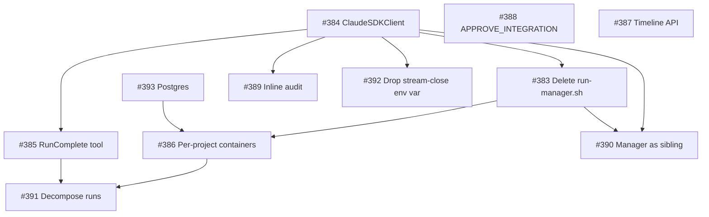

# Epic 382 — Architectural Overhaul Roadmap

**Status**: design
**Date**: 2026-05-14
**Author**: brainstorming session synthesis
**Epic**: [#382](https://github.com/kenhaesler/claude-agent-station/issues/382)
**Companion specs**: 11 files under `docs/superpowers/specs/2026-05-14-issue-*.md`

## Context

Epic 382 was opened after the PR #381 post-mortem. That PR closed a four-bug cascade — `_user_prompt_stream` returning early, intermediate `ResultMessage`s firing `orchestrator_complete` prematurely, the inner stream loop not breaking on work-complete, and the bundled SDK CLI subprocess not being reaped. Each bug only existed because of an architectural choice that can be revisited:

- **Two-headed orchestrator**: `agent/scripts/run-manager.sh` (3309 LOC bash) and `agent/station_orchestrator.py` (2533 LOC Python) cooperate across a subprocess + temp-file + env-var + webhook boundary. Most of PR #381's bugs lived at that seam.
- **Wrong SDK API**: `claude_agent_sdk.query()` is documented as one-shot. We use it for 30–50-minute Agent Teams sessions. PR #381's fixes are all hacks around that misfit.
- **Five uncoordinated "done" signals**: SDK `ResultMessage`, `_is_work_complete` text-matching, `orchestrator_complete` webhook, bash EXIT-trap, and `log_importer` scan all have to agree because none is authoritative.
- **Heuristic completion**: `_is_work_complete` regex-matches the lead's prose. The LLM's word choice is the contract.
- **Three uncoordinated reapers**: launcher zombie, dashboard stale, bash heartbeat.
- **Untestable bash**: 3309 LOC, no unit tests. Bugs found in production.

This roadmap decomposes the epic into 11 sub-issues, groups them into 6 milestones, surfaces dependencies, and gives each sub-issue its own design spec for downstream `writing-plans` work.

## Goals

- Eliminate the bash/Python orchestrator boundary as a structural source of bugs.
- Stop fighting the SDK; use `ClaudeSDKClient` for long sessions.
- Make completion structured (tool-call), not heuristic (prose-match).
- Make the bash heartbeat hack (#376) unnecessary by design.
- Give each project work-stream isolation (containers + multi-writer DB).
- Make verdict execution able to actually merge to the integration branch automatically.

## Non-goals

- Rewriting the Agent Teams flow (specialist worktrees, lead/manager pattern stays).
- Changing webhook payload shapes (dashboard contract preserved).
- Big-bang migration. Each tier ships independently; revertable per-PR.

## Dependency graph

Reading: `#384` is the linchpin — it unblocks five downstream items. `#388`, `#387`, `#393` are independent and can land any time. `#391` is the deepest leaf, requiring both isolation (#386) and structured completion (#385).

## Milestones

### M1 — Lifecycle foundation (Tier 1; blocks most of M3+)

Order: **#384 → #383 → #385**.

- **#384** (ClaudeSDKClient migration) kills the most root causes; epic estimates 1–2 sessions. Once landed, `_user_prompt_stream` and `_force_exit_with_cleanup` disappear and stream lifecycle is the SDK's responsibility.
- **#383** (delete run-manager.sh) is a natural follow-up. With the lifecycle clean, the launcher entry point is just `python -m agent.station_orchestrator --driver`. Ports preflight, workspace setup, queue purge, manager review, verdict execution, and integration-branch merge from 3309 LOC of bash into Python with pytest coverage. `STATION_LAUNCHER_USE_BASH` panic-revert flag retires.
- **#385** (RunComplete tool) replaces `_is_work_complete` heuristic with a structured SDK tool the lead calls. Completion becomes a tool-call, not a regex over prose. Cleanest after #384 because the new stream-event handler path is the natural place to detect the tool call.

**Done when**: a production-equivalent of `run-20260513T151408Z` runs end-to-end with no bash, no `_is_work_complete`, and a single authoritative `orchestrator_complete` event.

### M2 — Operator quick win (parallel to M1)

**#388 APPROVE_INTEGRATION**. Independent of M1. Highest-impact-per-LOC item in the epic — the operator's "PRs not merging" complaint resolves the moment the manager prompt and `verdict_execution.py` know how to pick this verdict. Can ship before #384 lands.

### M3 — Cleanups gated on M1

All depend on #384's `ClaudeSDKClient` migration.

- **#389** (audit log inline) — replace `audit_hook.py` SDK hooks with direct writes from the `ToolUseBlock` path. Eliminates `[hook-cb-fail]` and the SDK control-protocol dependency.
- **#390** (manager as sibling agent) — spawn the manager as a fourth Agent Teams sibling instead of a separate `claude -p` subprocess. Retires `manager_heartbeat` (#376) and the `manager.stream.jsonl` side channel.
- **#392** (drop `CLAUDE_CODE_STREAM_CLOSE_TIMEOUT`) — single-file cleanup. After auditing the few remaining `query()` call sites (`vision_analyst.py`, `plan_review_gate.py`), delete the env-var setter.

These three are cheap individually and natural to bundle into one or two PRs.

### M4 — Persistence + isolation

- **#393** (SQLite → Postgres) — change the SQLAlchemy URL, add a `db` service to `compose.yml`, port migrations, swap polling for LISTEN/NOTIFY. Independent of M1; the only thing blocking it is the migration script for existing data. Required prerequisite for #386.
- **#386** (per-project ephemeral containers) — once Postgres is multi-writer-safe and the launcher is Python-only (M1 #383), one container per run is trivial. Spawn via `docker compose run --rm`, mount the `station-data` volume, reap on exit.

### M5 — Observability

**#387 timeline API**. Independent. Adds `GET /api/runs/<run_id>/timeline` (a JOIN across `agent_events`, `audit_log`, `runs`, `coordinator_tasks`) plus a Timeline tab on the run-detail page. No new ingestion code. Can be scheduled whenever capacity allows.

### M6 — Scale

**#391 decompose long runs**. Deepest dependency. Needs container isolation (#386) and structured completion (#385) to fan out 2–5 concurrent sub-runs per issue. Includes a new `issue-splitter` agent role and smart-router decomposition policy.

## Suggested execution order

The epic body has a recommended numbered order. This roadmap follows it with one swap (#388 moved earlier as a quick win):

1. **#388** (APPROVE_INTEGRATION) — operator quick win, can ship today
2. **#384** (ClaudeSDKClient) — single highest-leverage item; ~1–2 sessions
3. **#383** (delete run-manager.sh) — Python-only launcher path; ~2 sessions
4. **#385** (RunComplete tool) — structured completion; ~1 session
5. **#390** (manager as sibling) — depends on #383 + #384
6. **#392** (drop env var) — trivial cleanup after #384
7. **#389** (audit inline) — depends on #384
8. **#387** (timeline API) — independent; nice for the dashboard
9. **#393** (Postgres) — independent; unblocks #386
10. **#386** (per-project containers) — depends on #383 + #393
11. **#391** (run decomposition) — depends on #386 + #385

## Risk register

| Milestone | Risk | Mitigation |
|---|---|---|
| M1 #384 | New `ClaudeSDKClient` lifecycle has different edge cases than the patched `query()` path | Keep PR #381's 29 tests as a regression net; add `ClaudeSDKClient`-specific tests; smoke-test against `run-20260513T151408Z` flow |
| M1 #383 | 3309 LOC of bash has tacit knowledge (env var defaults, error swallowing) that won't survive a literal port | Read every function before deleting; pytest each ported phase; keep `STATION_LAUNCHER_USE_BASH` as a one-PR-old revert path |
| M1 #385 | Lead might not reliably call `RunComplete` — schema validation failures could stall a run | Mandatory in system prompt + max-turns-still-no-tool-call escape hatch with explicit `incomplete` verdict |
| M2 #388 | Auto-merge to integration branch widens the blast radius of bad manager judgments | CI gate is mandatory before auto-merge; `APPROVE_INTEGRATION` is reserved for `dev_branch`, never `main` |
| M3 #389 | Stream-derived audit might miss tool calls that happen via control protocol but not `AssistantMessage` | Compare audit row count against today's hook-based count on three reference runs |
| M3 #390 | Manager-as-sibling sharing the lead's turn budget could starve real work | Track turn allocation in tests; raise lead's `--max-turns` if needed |
| M4 #393 | Migration downtime + production data export | Documented playbook with rollback (swap env var back, restore SQLite); test the migration script against an anonymised production dump first |
| M4 #386 | Container per run multiplies image-pull and start-up cost | Image is already local (`claude-agent-station/agent:dev`); measure cold-start before declaring done |
| M5 #387 | Cross-table JOIN may be slow on long-running installs | Index `agent_events.run_id`, `audit_log.run_id`, `coordinator_tasks.run_id` (likely already indexed; verify) |
| M6 #391 | Issue-splitter could over-decompose, producing trivial sub-issues | Lower bound: don't split anything where the parent issue is `< X` files of acceptance criteria; tunable |

## Spec stub index

Each issue has a companion spec in this directory:

- [#383 — delete run-manager.sh](./2026-05-14-issue-383-delete-run-manager.md)
- [#384 — ClaudeSDKClient migration](./2026-05-14-issue-384-clientsdk-migration.md)
- [#385 — RunComplete tool](./2026-05-14-issue-385-run-complete-tool.md)
- [#386 — per-project containers](./2026-05-14-issue-386-per-project-containers.md)
- [#387 — run timeline API](./2026-05-14-issue-387-run-timeline-api.md)
- [#388 — APPROVE_INTEGRATION verdict](./2026-05-14-issue-388-approve-integration-verdict.md)
- [#389 — inline audit from stream](./2026-05-14-issue-389-inline-audit-from-stream.md)
- [#390 — manager as sibling agent](./2026-05-14-issue-390-manager-as-sibling-agent.md)
- [#391 — decompose long runs](./2026-05-14-issue-391-decompose-long-runs.md)
- [#392 — drop stream-close timeout env var](./2026-05-14-issue-392-drop-stream-close-timeout.md)
- [#393 — Postgres migration](./2026-05-14-issue-393-postgres-migration.md)

## What this roadmap does NOT do

- Pick which sub-issue to implement first. That decision is the next gate after this doc is reviewed.
- Replace `writing-plans`. Each chosen sub-issue still goes through its own implementation plan before code is written.
- Lock the order. Independent items (#388, #387, #393) can be sequenced to match operator priorities.

## Open questions to resolve before implementation

1. **Sequencing**: ship #388 in parallel with M1, or hold for after #384?
2. **Postgres data migration**: tolerate the 5-minute downtime or build a dual-write transition window?
3. **Container runtime**: stay on `docker compose run` or move to a thin podman/kata wrapper for stronger isolation?
4. **Test parametrization for #393**: keep SQLite + Postgres both green in CI, or cut SQLite from the integration matrix once #386 lands?
5. **Verdict literal naming for #388**: the issue body proposes `APPROVE_DIRECT` / `PR_FOR_REVIEW`. The spec keeps the existing `APPROVE` / `PR` literals to avoid a coordinated rename across `run-manager.sh`, `Run.verdict` indexes, and historical analytics. Decide before writing the plan.
6. **`#391` integration target**: the issue body references `agent/coordinator/smart_router.py`; that source file is not in the tree (only `.pyc` artifacts). The implementation plan must locate the real integration module, or the spec needs to introduce `smart_router.py` as a new file.

## Drift / corrections discovered during this exercise

The architect teammates flagged these gaps between the epic issue bodies and current code. None change scope, but each is worth knowing before kicking off implementation:

- **`run-manager.sh` is 3309 LOC**, not the 3239 cited in #382 / #383.
- **`agent/agents/manager.md` does not exist yet** — #390's body says it "already exists; ensure it's set up as Agent Teams sibling." Treat as a new file sourced from `agent/prompts/manager.md`.
- **`agent/coordinator/smart_router.py` is `.pyc`-only.** See open question 6 above.
- **`vision_analyst.py` does not use SDK `query()`** — it shells out via `subprocess.run(["claude", "--print", ...])` at line ~179. The only surviving `query()` caller after Tier 1B (#384) is `agent/conflict_resolver/sdk_runner.py:95`. #392's audit step is real but smaller than the issue body implies.
- **#392's named test** lives at `dashboard/backend/tests/test_orchestrator_wiring.py:1643–1670`, not the repo-root path the issue implies.
